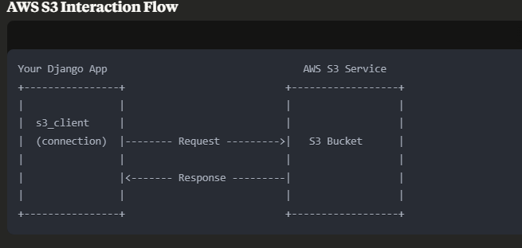
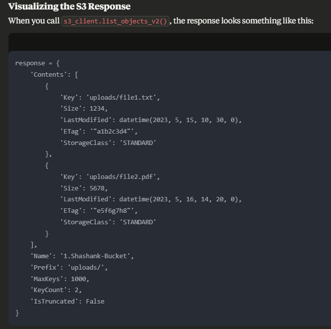
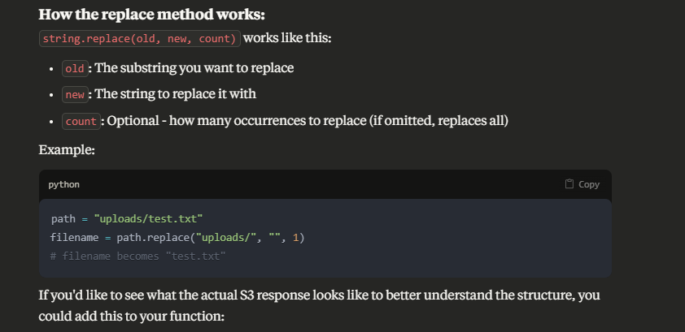

# AWS S3 API Visualization Project

## Introduction

This repository documents my learning journey with AWS S3 services through visual references. As I explore the various features and functionalities of Amazon S3, I'm collecting and creating images that help clarify the concepts, API workflows, and best practices for working with S3.

The goal is to build a visual reference that makes S3 concepts more accessible and easier to understand, both for my own learning and potentially for others working with AWS S3 services.

## Got to know: 
- "Params" means parameters

## S3 API Visualizations + General Concepts

*Description: request-response cycle*

*Description: Proper visualization*

*Description: request-response cycle*

### Bucket Operations

## Notes on Using These Visualizations

Each image in this repository represents a specific aspect of the S3 API. I've included descriptions with each image to explain what's being shown and how it relates to practical S3 usage.

Feel free to use these visualizations as a reference when working with AWS S3. More visualizations will be added as I continue exploring the service.

---

**Note**: This is a personal learning project. Always refer to the [official AWS S3 documentation](https://docs.aws.amazon.com/s3/) for the most up-to-date information.